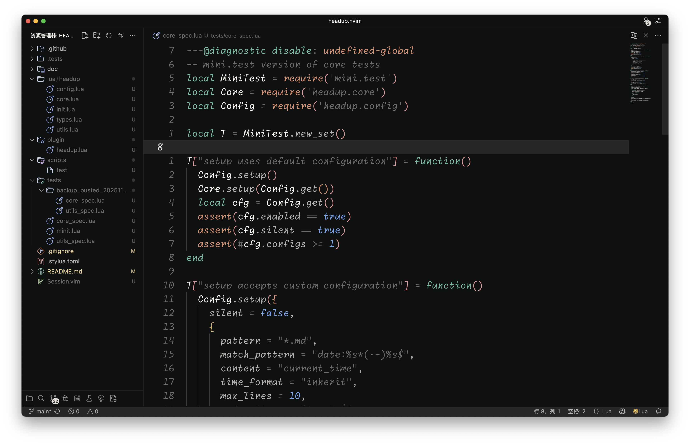
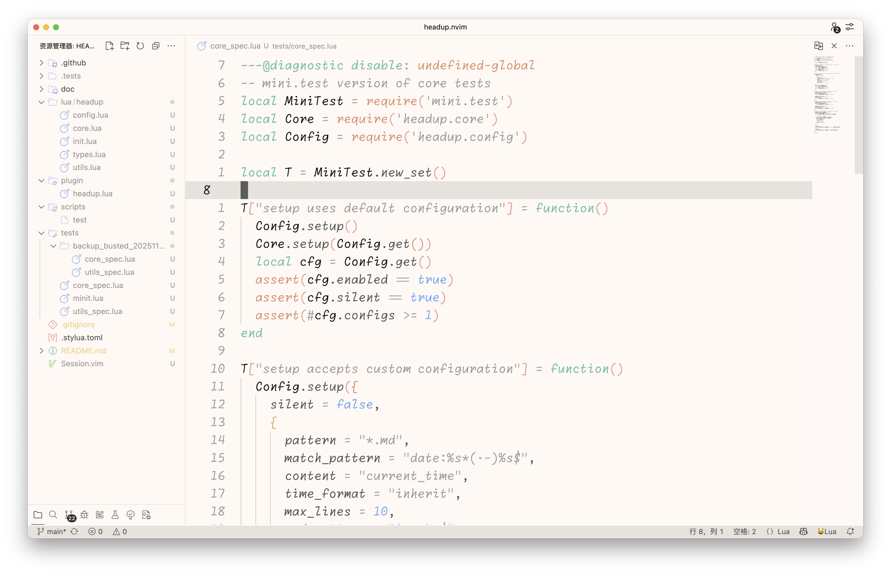

<h1 align="center">oQ Theme for VS Code</h1>

<p align="center">


<a href="https://marketplace.visualstudio.com/items?itemName=froQ.theme-oq" target="__blank"></a>
</p>

## Match with System

<!--eslint-skip-->

```jsonc
// .vscode/setting.json
{
  "window.autoDetectColorScheme": true,
  "workbench.preferredLightColorTheme": "oQ Light",
  "workbench.preferredDarkColorTheme": "oQ Dark",
}
```

## Links

- [Vitesse Theme](https://marketplace.visualstudio.com/items?itemName=antfu.theme-vitesse). Great theme, probably my favorite.
- [@antfu](https://github.com/antfu), author of Vitesse Theme and many other great [projects](https://antfu.me/projects).

## Thanks

This project is based on [Vitesse Theme](https://marketplace.visualstudio.com/items?itemName=antfu.theme-vitesse) by [Anthony Fu](https://github.com/antfu).

## License

MIT - Copyright (c) 2020 Primer <br>
MIT - Copyright (c) 2021 Anthony Fu
<br>
MIT - Copyright (c) 2025 froQ
